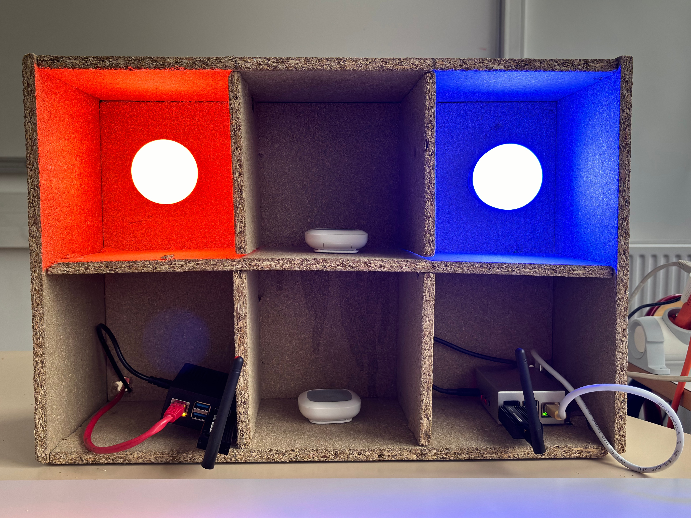

# Réalisation de la maquette

Afin de présenter notre projet, nous avons réalisé une maquette. Cette dernière vise à représenter une maison, avec chaque compartiment dédié à un objet connecté différent. Ci-dessous, vous trouverez une photo de la maquette :

## Création de la maquette

Comme mentionné précédemment, l'objectif de cette maquette était de symboliser une maison en intégrant les objets dont nous disposions. Avec 2 ampoules, 2 capteurs, et 2 Raspberry Pi à notre disposition, nous avons créé une maquette comprenant 6 compartiments.

Les capteurs fonctionnent sur pile, éliminant ainsi le besoin de les connecter à une source électrique. En revanche, les Raspberry Pi (RPI) et les ampoules nécessitaient une alimentation électrique.

### Première étape : le bois

Pour la réalisation de notre maquette, nous avons acquis des planches d'OSB que nous avons découpées pour obtenir un rectangle de 45 cm x 30 cm (à l'intérieur). Par souci de stock et de budget, nous avons choisi l'OSB comme matériau de construction.

### Deuxième étape : les alimentations

Comme mentionné précédemment, les ampoules et les Raspberry Pi nécessitent une alimentation électrique. Pour les Raspberry Pi, nous avons simplement percé des trous sur les côtés des compartiments pour faire passer les câbles d'alimentation et Ethernet. En ce qui concerne les ampoules, nous avons créé des ouvertures pour insérer des douilles E27. Ensuite, nous les avons connectées à une prise via des dominos reliés à une multiprise. La rallonge entre le domino et la multiprise est une extension dont Mathis a besoin ultérieurement. Par conséquent, nous avons choisi de ne pas la couper pour éviter d'avoir à la refaire. Voici la photo de l'arrière de la maquette.

### Troisième étape : création du réseau Internet

Pour le bon fonctionnement du projet, un réseau Internet commun à tous les appareils (ampoule Wi-Fi, Raspberry Pi, et PC portables) était nécessaire. Nous avons ainsi établi un partage de connexion depuis l'un de nos téléphones vers un routeur Wi-Fi. Ce routeur permettait à l'ampoule de se connecter en Wi-Fi et aux Raspberry Pi de se connecter au même réseau via une liaison Ethernet, du routeur vers un hub Ethernet, puis vers nos Raspberry Pi.

### Dernière étape : mise en place de la démo

Une fois toutes ces étapes réalisées, il ne restait plus qu'à brancher la maquette, attendre quelques minutes que les Raspberry Pi s'allument et rendent les applications Home Assistant et OpenHAB utilisables. Ensuite, nous étions prêts à passer à la démonstration.
