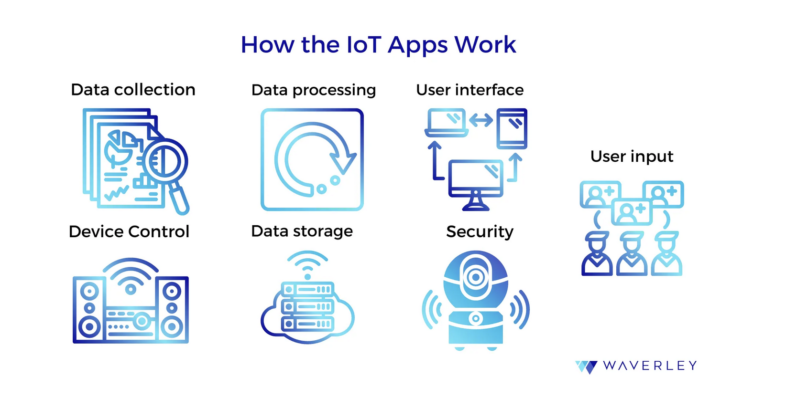

# SMART HOME APPLICATION

Ce projet consiste à concevoir étape par étape une application permettant d'interconnecter divers objets connectés, existants sur le marché. Cette application est décortiquée et présentée dans ce répertoire GitHub, afin d'en comprendre les différents aspects et objectifs. 

## 1- INTRODUCTION

### DESCRIPTION DU PROJET

En premier lieu, il faut se poser la question suivante: **comment fonctionnent les objets connectés ?** Cette question rassemble non seulement les différents types d'objets connectés existants et leurs différents domaines d'application, mais aussi les protocoles de communication mis en oeuvre selon ces domaines. Dans notre cas, il s'agit d'une maison connectée. Nous pouvons donc avoir affaire aux objets **connectés** suivants *(liste non exhaustive)*:

- Ampoules RGB 
- Prises
- Chauffage
- Volets roulants
- Système de sécurité *(caméra(s), alarme(s), capteur(s) de mouvement,...)*
- etc.

Dans notre cas, nous allons vous présenter quelques uns de ces objets au travers de ce projet, et nous allons couvrir plusieurs protocoles de communication connus, comme:

- WiFi
- Bluetooth
- Zigbee
- Xbee
- etc.

En fonction des protocoles de communication mis en place, il n'y a pas seulement l'objet et l'application à prendre en compte, mais aussi parfois une passerelle permettant de transmettre les informations de l'application vers l'objet connecté (par exemple en Zigbee, une passerelle est connectée à une box WiFi - *ou partage de connexion* - et transmets les requêtes en Zigbee jusqu'aux objets concernés).

Ainsi ce projet permettra de décrire comment concevoir une application permettant de se connecter à divers appareils connectés via différents protocoles et différentes installations.

### DIAGRAMME BÊTE A CORNE

## 2- ARCHITECTURE DE L'APPLICATION

Avant de commencer toute activité, il faut décider de l'architecture de l'application, car cette dernière devra non seulement permettre la communication avec différents appareils connectés, mais devra aussi traiter les données provenant de ces objets *(capteurs de température, de mouvement, flux vidéo,...)* afin d'en retirer un comportement voulu *(monter la température, fermer un volet, alerter le propriétaire d'un mouvement inhabituel,...)*.

L'application doit donc permettre les choses suivantes:
- La collection de données
- Le traitement de ces données
- Une interface utilisateur
- Le contrôle des objets 
- La sauvegarde de ces données en mémoire 
- Une sécurité 
- Des entrées utilisateurs *(envoyer des commandes de température, de couleur, d'actions particulières,...)*

L'application mettra donc en oeuvre des concepts de matériel, de protocoles de transmission, mais aussi de base de donnée, de front-end / back-end afin de parvenir à piloter une maison connectée. 

### Modèles

- Collection (organisation des tâches en différentes catégories)
    - Nom
    - "Slug"
- Tâche
    - Description
    - Collection d'appartenance (clé d'appartenance à une collection)

### Fonctionalités 

[ ] Ajouter une collection  
[ ] Supprimer une collection  
[ ] Ajouter une tâche  
[ ] Supprimer une tâche  
[ ] Scripter les tâches (exemple ampoules RGB, modes de couleurs)
 

# BIBLIOGRAPHIE / LIENS UTILES

## "HOW TO CREATE AN IOT APP" 

https://waverleysoftware.com/blog/how-to-create-an-iot-app/

Structure de l'application selon ce site : 

## WEB APPLICATION

### ZIGBEE TO MQTT

https://www.youtube.com/watch?v=frwhcYQKElU

### DEVELOPPER UNE APP WEB AVEC PYTHON

https://www.youtube.com/watch?v=ns7cmSaiA9E

### NORME IEEE

https://ieee-iotj.org/

### MQTT SWIFT

https://medium.com/@prithvi2229/a-comprehensive-guide-to-connecting-with-iot-devices-in-ios-using-swift-and-cocoamqtt-d841af2a9cc2

### HEBERGEMENT APP WEB 

https://www.axiocode.com/heberger-application-mobile/

### CREER APP WEB

https://agence-scroll.com/blog/creer-application-web

### UTILISER UN RASPBERRY EN TANT QUE SERVEUR

https://www.toptal.com/raspberry-pi/how-to-turn-your-raspberry-pi-into-a-development-server
