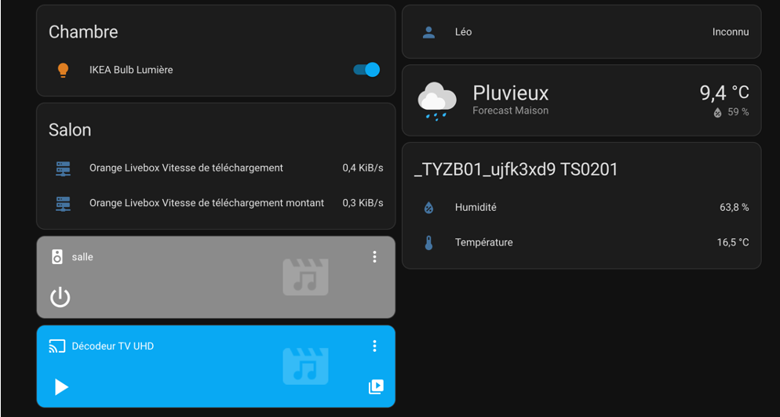

# Utilisation de Home Assistant

  

Home Assistant est une plateforme open-source qui vise à centraliser l'utilisation d'objets connectés sur une seule interface. HA (Home Assistant) permet de connecter des appareils de différentes marques utilisant divers protocoles.

HA peut être utilisé de différentes manières. Dans notre cas, nous avons utilisé HA sous forme de système d'exploitation.

## Notre expérience Home Assistant

Après avoir développé notre application du mieux que possible, nous avons voulu nous orienter vers les plateformes d'automatisation Home Assistant et OpenHab.

Home Assistant est très facile d'utilisation, nous avons pu assez facilement utiliser la plateforme et y connecter nos appareils.

## Installation

Le site de [Home Assistant](https://www.home-assistant.io/) explique très bien l'installation. On peut également trouver plusieurs tutoriels sur YouTube expliquant en détail le processus.

Nous allons brièvement expliquer l'installation de Home Assistant dans notre cas.

Nous avons installé HA OS sur un RPI4 et un RPI5 (nos Raspberry Pi personnels).

> Pour cela, il suffit d'installer l'OS à partir de RPI Imager. Après avoir sélectionné le modèle de son RPI, rendez-vous dans la rubrique "Système d'exploitation", puis dans "Other Specific-purpose OS", suivi de "Home Assistants and Home Automation", puis enfin "Home Assistant" et "Home Assistant OS". Selon la version de RPI Imager, il est également possible de renseigner directement le réseau WiFi si l'on ne souhaite pas ou que l'on ne peut pas connecter le RPI en Ethernet.

> Une fois cela fait, branchez d'abord votre clé Zigbee, puis votre câble Ethernet (si vous ne préférez pas passer par le WiFi), et enfin l'alimentation.
>
> Lors de la première installation, la configuration de Home Assistant peut prendre jusqu'à 25 minutes. Après cela, connectez-vous à la page web émise par le RPI sur votre réseau Internet local. Vous pouvez vous y connecter via ce lien : `http://homeassistant:8123/` ou avec son adresse IP. (Pour trouver l'adresse IP du Raspberry Pi, nous avons utilisé l'application Fing).

Vous arriverez ensuite sur une page de configuration similaire à celle-ci :

Après avoir créé un compte pour votre système d'exploitation, nous avons pu connecter différents appareils.

Ensuite, nous avons ajouté nos appareils connectés et créé nos vues personnalisées.

## Notres utilisation

Voici la vue que nous avions créée chez Léo :

Sur cette vue, nous pouvons voir notre ampoule IKEA ainsi que nos capteurs d'humidité et de température, tous connectés en Zigbee. Bien que nous n'ayons pas encore reçu l'ampoule Xiaomi (fonctionnant en WiFi), son ajout à HA était simple grâce à sa disponibilité en WiFi.

En effet, Home Assistant est capable de détecter dès le départ tous les appareils présents sur notre réseau WiFi. C'est pourquoi nous pouvons voir le décodeur télé de Léo ainsi que des enceintes dans son salon (ces appareils étant connectés au réseau WiFi).

## Pour aller plus loin 

Il est possible avec HA de créer plusieurs automatisations, notamment en utilisant les scripts. En effet, HA utilise des scripts en YAML afin de pouvoir automatiser diverses utilisations. Dans notre cas, étant donné que nous ne possédions que 2 capteurs et 2 ampoules, il nous était compliqué de créer des automatisations cohérentes. 

Voici plusieurs exemples d'utilsation possibles (en rajoutant certaines fois des objets connectés) : 

> - Couleurs des lampes : HA étant connecté à internet, il est possible de le connecter les ampoules pour que leur intensité ou leur couleur change en fonction de l'heure de la journée. 
>
> - Chauffage connecté : Il est possible avec HA d'utiliser son téléphone, en partant de ce principe, il est possible d'allumer son chauffage lorsque l'on quitte son travail par exemple ou bien de l'éteindre une fois que l'on est pas dans la maison
>
> - Sécurité dans la maison : Comme nous l'avons déjà dit, il est possible de connecter énormément d'appaeils à HA. En partant de ce principe, il est tout à fait faisable de créer son propre système de sécurité. En effet, on peut acheter des caméras ainsi que des capteurs de position et les connecter à HA. En alliant à cela le fait de pouvoir localiser le téléphone, on pourrait imaginer que l'alarme de HA puisse s'activer automatiquement lorsque l'on quitte son logement, ou l'inverse lorsque l'on retourne chez soi. 

Il serait possible de multiplier les exemple d'utilisation avec HA. 

C'est pour cette raison ainsi que pour le fait que l'on puisse très facilement connecter divers appareils de différentes marques ou protocoles que nous jugeons la solution HA comme étant la meilleure parmi les 3 testées. 