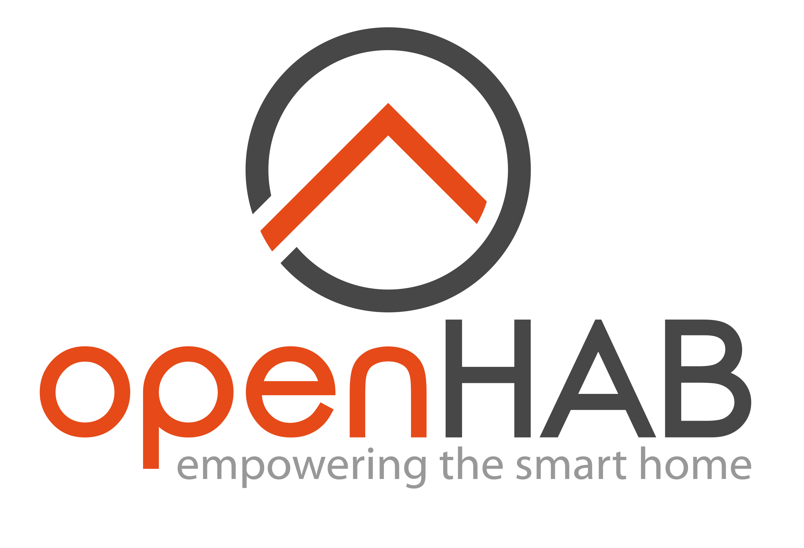

# Utilisation de OpenHab

  

OpenHab, comme Home Assistant est une platefrome open-source qui vise à centraliser l'utilisation d'objets connectés sur une seule interface. OH (OpenHab) permet de connecter des appareils de différentes marques utilisant divers protocoles.

OpenHab peut être utilisé de différentes manières, dans notre cas nous avons fait le choix d'utiliser OH avec son système d'exploitation. 

# Notre expérience Home Assistant

De même que pour Home Assistant, nous avons souhaité nous orienter vers Home Assistant et OpenHab  une fois que nous étions arrivé au bout de notre application python. 

Pour OpenHab, la plateforme ne s'est pas avérée aussi simple d'utilisation que Home Assistant. Nous reviendrons plus tard sur dans ce document, cependant nous n'avons jamais réussi à reconnaître les appareils. 

## Installation 

Pour réaliser l'installation de OpenHab, nous avons suivi une vidéo youtube de OpenHab quand à [l'installation d'OpenHabian](https://www.youtube.com/watch?v=-U4-ZFYftLY&t=65s). OpenHabian est le système d'exploitation d'OpenHab. 

Cette vidéo youtube correspond complétement à notre cas puisqu'elle permet d'installer OpenHabian ainsi qu'un Broker MQTT. 

Nous n'allons pas détailler l'installation de OpenHabian qui est déjà expliquée dans la vidéo et que se trouve être approxima

## Notre utilisation

Comme nous avons pu le dire plus tôt nous n'avons pas réussi à utiliser OpenHab. Nous avons bien réussi à l'installer et à reconnaître les mêmes appareils wifi qu'avec Home Assistant (ampoule wifi, enceintes wifi et décodeur tv). 

Cependant nous n'avons jamais réussi à connecter nos appreils. Nous arrivions bien à detecter notre dongle zigbee mais pas les capteurs. 

En utilisant directement la méthode sur Ordinateur (Broker MQTT + Zigbee2MQTT), nous arrivons à voir les capteurs dans le terminal et à récupérer leurs informations. 

N'arrivant pas à utiliser OpenHab et en se rendant compte que Home assistant était plus simple d'utilisation et tout aussi efficace, nous avons souhaité arrêter nos recherches sur OpenHab. 

De plus, OpenHab est beaucoup moins documenté qu'Home Assistant ce qui implique notre choix. 